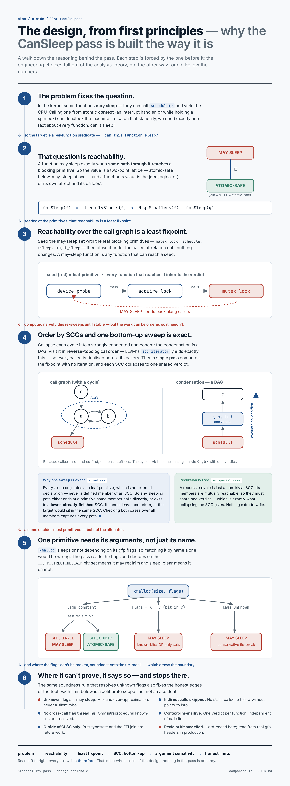

# Sleepability Pass — a C-side `CanSleep` summary for the Linux kernel

<!-- After the first push, replace AnnanyaSood1/sleepability-pass below with your GitHub path (e.g. jane/sleepability-pass). -->
[](https://github.com/AnnanyaSood1/sleepability-pass/actions/workflows/ci.yml)

An out-of-tree **LLVM module analysis pass** (new pass manager) that decides, for
every function in a module, whether it **may sleep**: whether it can, directly or
transitively, reach a blocking primitive. This is the "callee summary" that a
caller in atomic context (an interrupt handler, a spinlock critical section)
needs in order to know it must not make the call.

```
$ opt -load-pass-plugin build/libSleepability.so -passes=sleepability \
      -disable-output build/ll/04_gfp.ll

=== Sleepability analysis (C-side CanSleep summary) ===
module: build/ll/04_gfp.ll

  [ATOMIC-SAFE]  alloc_atomic  -- no path to a blocking primitive
  [MAY SLEEP  ]  alloc_sleepy  -- calls kmalloc() with direct-reclaim gfp flags (may sleep)

summary: 1 may-sleep, 1 atomic-safe (2 functions analysed)
```

## What this is (and what it is not)

This is the **standalone C-side half of a Cross-Language Sleepability Checker
(CLSC)**. It answers one concrete question that a full checker also has to
answer: *given the C call graph, which functions may sleep?* Everything else in
the larger design — the Rust typestate that tracks atomic vs. sleepable context,
and the FFI join that connects a Rust caller to this C summary across the
`rust_helper_*` boundary — is **deliberately out of scope here** and is future
work. This artifact does not claim CLSC works; it demonstrates that the
interprocedural static-analysis core of its C side is real, builds, and runs.

## The analysis in four steps

1. **Build the call graph** (`llvm::CallGraph`).
2. **Mark leaf blocking primitives by name** — `mutex_lock`, `schedule`,
   `msleep`, `might_sleep` — plus the argument-sensitive allocator `kmalloc`.
3. **Propagate `CanSleep` bottom-up over strongly connected components.**
   `llvm::scc_iterator` visits SCCs in reverse-topological order, so every callee
   is finalised before its callers. An SCC (including a recursive cycle) collapses
   to a single verdict: if any member reaches a blocking primitive, all members
   may sleep.
4. **Print a deterministic per-function verdict** with a short reason.

Terminology note: `CanSleep == true` is reported as `MAY SLEEP`; `CanSleep ==
false` as `ATOMIC-SAFE` (safe to call from atomic context). This is the property
of a *function*; a full checker pairs it with the *context* at each call site.

### Argument sensitivity: `kmalloc` and gfp flags

`kmalloc(size, flags)` may sleep **iff** its gfp flags request direct reclaim.
The pass keys off the `__GFP_DIRECT_RECLAIM` bit: `GFP_KERNEL` sets it (may
sleep), `GFP_ATOMIC` does not (atomic-safe). So `kmalloc(n, GFP_KERNEL)` is
flagged and `kmalloc(n, GFP_ATOMIC)` is not — the pass is sensitive to the
*value of an argument*, not just the callee name.

As a stretch, the pass also performs **intraprocedural known-bits reasoning**:
`kmalloc(n, extra | GFP_KERNEL)` is caught even though `extra` is unknown,
because an `or` with a constant that sets the reclaim bit sets it regardless of
the other operand.

## Design rationale

Every design choice below is forced by the one before it — the engineering falls
out of the analysis theory. The one-page figure walks the full chain (problem →
reachability → least fixpoint → SCC bottom-up → argument sensitivity → honest
limits); `docs/DESIGN.md` gives the prose, including the soundness argument.



*(High-resolution PDF: [`docs/img/design-rationale.pdf`](docs/img/design-rationale.pdf).)*

## Build

Requires an LLVM/Clang toolchain (developed and tested against **LLVM 18** on
Ubuntu 24.04) and CMake ≥ 3.20. Ninja is used if present.

```sh
# Ubuntu: sudo apt-get install llvm-18-dev clang-18 cmake ninja-build
./scripts/build.sh
```

`build.sh` auto-detects `llvm-config`; override with
`LLVM_CONFIG=llvm-config-17 ./scripts/build.sh`. The result is
`build/libSleepability.so` (`.dylib` on macOS).

## Run the tests

```sh
./scripts/run_tests.sh        # compile each test to IR, run the pass, diff vs expected
./scripts/run_tests.sh -v     # show diffs on any failure
./scripts/run_tests.sh --update   # regenerate tests/expected/*.txt
```

Expected result:

```
PASS  01_direct_mutex
PASS  02_chain
PASS  03_nonsleeping
PASS  04_gfp
PASS  05_bitmask
PASS  06_recursion
PASS  linked
----
7 passed, 0 failed
```

## Results

The suite builds against LLVM 18 and passes in full, on every push, verified by
CI (badge above):

```
PASS  01_direct_mutex     rust_helper shim -> mutex_lock            MAY SLEEP
PASS  02_chain            level3 -> level2 -> level1 -> schedule    MAY SLEEP (transitivity)
PASS  03_nonsleeping      pure computation                         ATOMIC-SAFE
PASS  04_gfp              kmalloc(GFP_KERNEL) vs kmalloc(GFP_ATOMIC) split correctly
PASS  05_bitmask          extra | GFP_KERNEL caught (known-bits)
PASS  06_recursion        sleeping cycle vs clean cycle            SCC collapse
PASS  linked              cross-TU probe -> helper -> mutex_lock    MAY SLEEP
----
7 passed, 0 failed        (17 functions over 7 modules, 11 may-sleep / 6 atomic-safe)
```

**What this demonstrates, stated honestly.** The interprocedural core is
implemented and correct across the properties that matter: transitivity, cycles
(SCCs), argument sensitivity, intraprocedural known-bits, and cross–translation-unit
propagation. Each test isolates one property, with a near-miss control
(`GFP_ATOMIC` beside `GFP_KERNEL`) so precision is shown, not just recall.

**What it does not yet claim.** These inputs were written to exercise the analysis,
so passing them proves the analysis is *correct on them* — a proof of concept, not
an empirical result on third-party code. Running the pass over real
`rust_helper_*` wrappers or a slice of kernel IR, and reporting what it finds
(including where it is wrong), is the evaluation step and is future work. The
verdict of a function is sound-by-construction for the modelled primitives: where
the pass cannot prove atomic-safety (unknown gfp flags, indirect calls) it
over-approximates to `MAY SLEEP` rather than risk a silent miss.

## Run it on your own code

```sh
clang-18 -S -emit-llvm -O0 mycode.c -o mycode.ll
opt-18 -load-pass-plugin build/libSleepability.so \
       -passes=sleepability -disable-output mycode.ll
```

No kernel build is required: the primitives are recognised by name as external
declarations, so ordinary `.c` files compiled with `clang -S -emit-llvm` are
enough. Multiple translation units can be combined with `llvm-link` first (see
the `linked` test) for whole-program interprocedural results.

## Test suite

The suite mirrors the fault-injection design of the research proposal in
miniature: each input isolates one property, with a near-miss control for
precision.

| Test | What it exercises | Expected |
|------|-------------------|----------|
| `01_direct_mutex` | `rust_helper_*`-style shim forwarding to a primitive | `rust_helper_mutex_lock` **may sleep** |
| `02_chain` | transitivity three levels deep | `level1/2/3` all **may sleep** |
| `03_nonsleeping` | genuinely atomic-safe code (incl. `memcpy`) | all **atomic-safe** |
| `04_gfp` | argument sensitivity — the precision control | `GFP_KERNEL` **may sleep**, `GFP_ATOMIC` **atomic-safe** |
| `05_bitmask` | known-bits: `extra \| GFP_KERNEL` still caught; unknown flags stay conservative | both **may sleep** (one provable, one conservative) |
| `06_recursion` | SCC collapse for recursive cycles | sleeping cycle both **may sleep**; clean cycle both **atomic-safe** |
| `linked` | cross–translation-unit interprocedural (`llvm-link`) | probe in one file, helper in another, both **may sleep** |

Across the suite: 17 functions over 7 modules, 11 may-sleep / 6 atomic-safe, all
classified as expected.

## Limitations and future work

Calibrated scope, stated honestly:

- **Name-based primitive recognition.** Blocking primitives are matched by
  symbol name. Macro-expanded or aliased spellings, and a real kernel's full
  primitive set, are not modelled beyond the demonstrative list.
- **Indirect calls are not resolved.** Calls through function pointers are
  skipped (no call-graph edge is followed). Sound handling would treat them
  conservatively or require points-to information.
- **gfp handling is intraprocedural.** The literal and known-bits cases are
  handled. *Interprocedural* flag threading — a forwarding wrapper
  `f(n, flags){ return kmalloc(n, flags); }` whose caller passes `GFP_KERNEL` —
  is not: deciding it needs argument-value propagation across call boundaries.
  This is the exact boundary marked for the proposal's constant/bitmask
  propagation work.
- **No context sensitivity.** A function has one verdict for all call sites.
- **The reclaim bit is modelled** as `0x400` (matching recent kernels); in
  production it would be read from the kernel's `gfp_types.h` rather than
  hard-coded.
- **The Rust typestate side and the FFI join are not here.** They are the other
  halves of CLSC and remain future work.

## Repository layout

```
src/SleepabilityPass.cpp   the pass (call graph + SCC fixpoint + gfp arg-sensitivity)
CMakeLists.txt             out-of-tree plugin build
scripts/build.sh           configure + build
scripts/run_tests.sh       compile tests to IR, run, diff vs expected
tests/*.c                  kernel-shaped inputs
tests/link/*.c             cross-TU inputs (linked with llvm-link)
tests/gfp.h                self-contained gfp flag model
tests/expected/*.txt       frozen expected output
docs/DESIGN.md             design notes: algorithm, soundness, decisions
docs/img/                  one-page design-rationale figure (png + pdf)
```

## Authorship and provenance

## Authorship

**Author:** Annanya Sood — <annanyas0142@gmail.com>

I scoped this project and own its design. The decisions are mine: to build the
C side as a standalone artifact that answers one well-posed question rather
than a partial version of the whole checker; to make argument sensitivity the
target, since `kmalloc(size, flags)` is where a name-based analysis stops being
sufficient and the property becomes a question about a *value*; to propagate
bottom-up over SCCs so that recursion and mutual cycles collapse to one verdict;
to over-approximate to MAY SLEEP wherever atomic-safety cannot be proven, so the
pass fails toward false positives rather than silent misses; and to pair each
test with a near-miss control, so the suite demonstrates precision and not only
recall. The limitations section is mine too, and states what the artifact does
not do.

The implementation — the LLVM pass, the CMake build, the test harness, CI, and
this documentation — was written with AI assistance (Claude, by Anthropic)
working to that direction. The analysis design, its soundness argument, and its
stated boundaries are set out in [`docs/DESIGN.md`](docs/DESIGN.md). I can
account for each component and the reasoning behind it, and I take
responsibility for the artifact as published.

The figures in `docs/img/` are AI-rendered from `docs/DESIGN.md`.

## License

MIT — see `LICENSE`.
